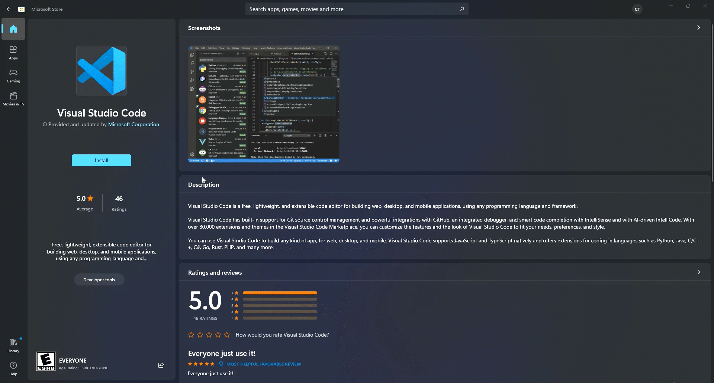
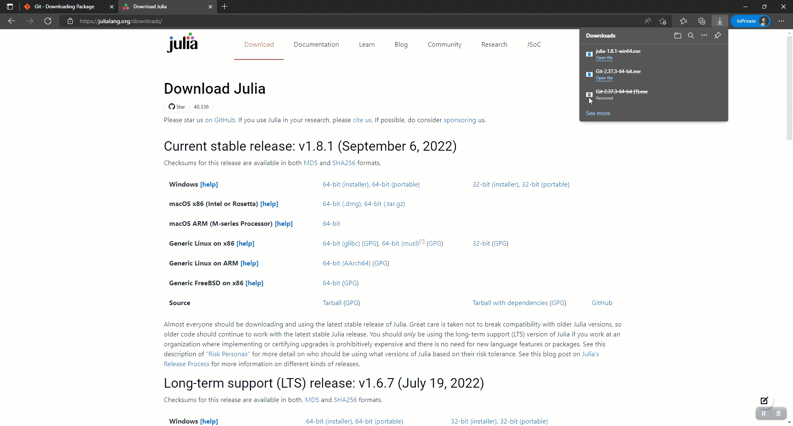
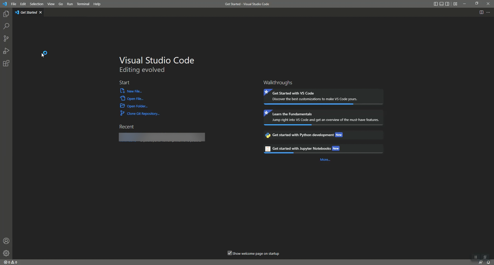

# JULIA + JUPYTER + VSCODE OFFLINE INSTALL ON WINDOWS
1. Install VS code from microsoft store
    * Go to microsoft store and search for VS Code
    * Click Install to Install VS Code

2. Install Git
    * Open your web browser and search for [https://git-scm.com/](https://git-scm.com/).
    * Click on downloads and download the latest version of git.

    * Once downloaded open the installer file.
    * You can click next repeatedly untill the installation starts. I dont prefer some default options so if you want to have my setup do the following
        - Uncheck Windows Explorer Integration.
        - Change Default editor to VS Code.
        - Change the terminal to windows command line from MINTTY.
        - Everything else stays in it's default value.

3. Install Julia
    * Open your web browser and search for [https://julialang.org/](https://julialang.org/).
    * Click on download and download the latest version of Julia.

    * Once downloaded open the installer file.
    * You **MUST CHECK** add julia to path. Then you can click next repeatedly untill the installation starts.

4. Setup VS Code Environment
    * If you already have VS Code open close it and reopen it. Else open VS Code.
    * Open a folder where you want the class notes to be. I have chosen my desktop.

    * Go to the *Source Control* tab on the left vertical tool ribbon.
        * This tab should say *Initialize Repository*, if you see this then you are good for the next step.
        * If it says *Install Git* try restarting VS Code or your system. If the problem still persists Git is not installed properly try uninstalling and reinstalling Git (Step 2).
    * Clone the repository to the folder
        * Click <kbd>Shift</kbd> + <kbd>`</kbd> to open terminal (Alternatively you can also click on Terminal &rarr; New Terminal from title bar).
        * Type ```git clone https://github.com/cortner/math405_2022.git``` in the terminal (you can also get this link by clicking copy from the github repository provided).
        * Press enter and wait for the process to complete.
            * In the terminal a process is only done when you see the cursor next to a ```>``` symbol and you are able to type into it. Otherwise the installation is still going on.

    * Now we need to install the required extensions in VS Code
        * Go to the *Extensions* tab on the left vertical tool ribbon.
        * Searh and install the following extensions
            * Julia
            * Jupyter
            * Python  
        * If installed correctly when you now clear the search bar you will see Julia, Jupyter, Jupyter Keymap, Jupyter Notebook Renderers, Pylance and Python under installed extension. If any one of the specified is missing install them seperately.  
        * ***IMPORTANT: THE EXTENSION JULIA IS FROM julialang AND THE EXTENTIONS Jupyter, Jupyter Keymap, Jupyter Notebook Renderers, Pylance and Python ARE FROM MICROSOFT, BEWARE WHEN INSTALLING EXTENSIONS DO NOT INSTALL FROM ANY OTHER DEVELOPER WITHOUT FURTHER INSPECTION OR RESEARCH***

5. Installing packages
    * If you already have VS Code open close it and reopen it. Else open VS Code.
    * Click on File&rarr;Open Folder and open the **math405_2022** folder on VScode. This will be present in the folder that we opened in step 4.2.
    * Click <kbd>Shift</kbd> + <kbd>`</kbd> to open terminal (Alternatively you can also click on Terminal &rarr; New Terminal from title bar).
    * Type ```cd notes``` in the terminal (this changes your current working directory to notes) and press enter.
    * Now type ```julia``` and press enter.
    * Julia interpreter will start (You will know this, It will say JULIA in very fancy letters).
    * Now we need to open the math405.jl file so type ```include("math405.jl")``` and press enter, wait for the entire process to complete. It will take some time to complie and get all the required files.
    * Once the process is complete type ```Pkg instantiate()``` and press enter this will install all the required components for the functioning of the lab. This process will take quit a bit of time so be patient.
    * Once done restart VS Code.

6. Final stage!!!!
    * If you haven't open the **math405_2022** folder.
    * Create a copy of the first note **L01-Introduction.ipynb**.
    * Open the copy that you just created. Give jupyter notebook some time to load in everything. If you have installed everyting right you should see ***julia1.0.8*** on the right-top corner of your notebook this is called the ***kernal***.
    * Click on ***julia1.0.8***, you should see a drop down with julia, and Python mentioned as ***(base) python version number***.
    * If you don't see python, then restart system or restart VS Code. If the problem persists redo from step 5.
    * Now we need to install ipnyb package. To do this, just change julia to python from the dropdown. You should start seeing VS Code installing various ipynb packages on the bottom right. If you dont see this try running the first cell (click on the first code cell and press Shift + Enter) alone keeping the kernal as python.
    * Once there is no more information on the bottom right pop ups, change the kernal back to julia and restart VS code (I prefer a system restart).
    * Now when you reopen and run the copy. It should not throw any errors and work as intended.

7. Happy Coding!

        


